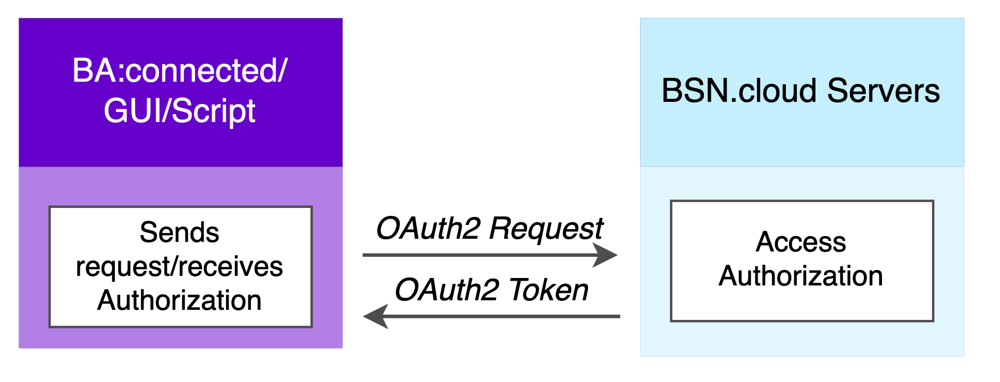
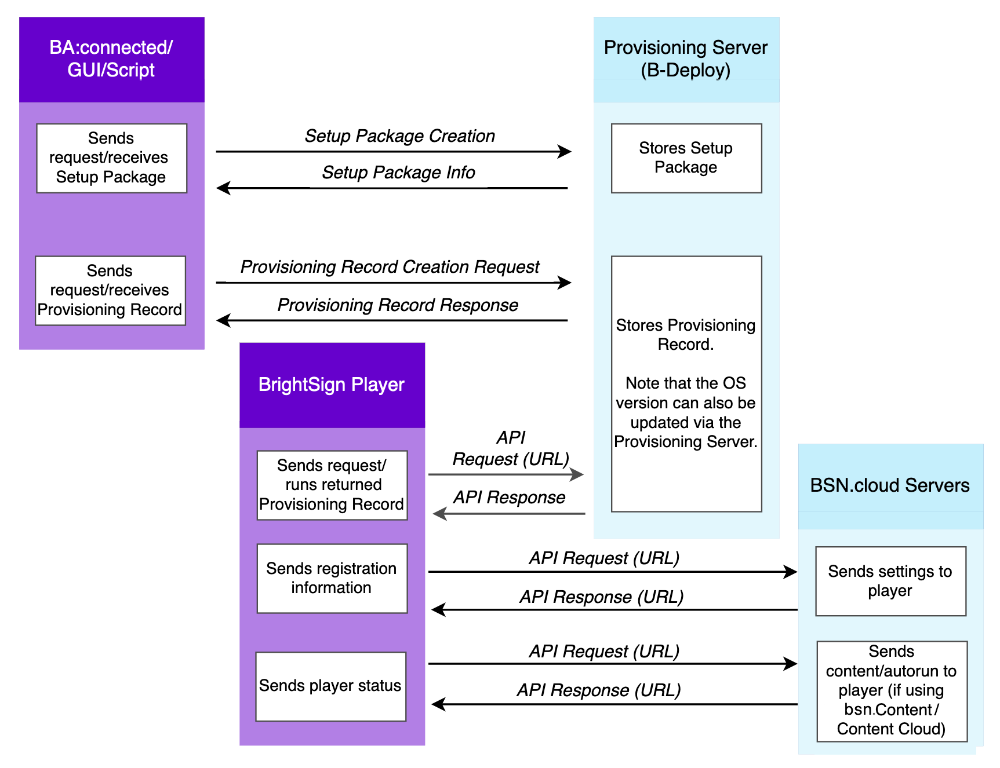

# Cloud APIs

BrightSign cloud APIs can be categorized as follows:

*   **Basic Authorization APIs** control access to all of the BSN.cloud or BrightSignNetwork.com resources in your network.
    
*   **B-Deploy (Provisioning) APIs** provide tools for managing automated deployment packages.
    
*   **BSN.cloud and .com Service APIs** expose the functionality of our BrightAuthor and BrightAuthor:connected content management systems and let you monitor and manage BrightSign players.
    

Note that the diagrams below describe BSN.cloud servers and APIs, but [BrightSignNetwork.com](http://BrightSignNetwork.com) servers and APIs work in the same way.

## Basic Authorization APIs

An [OAuth](./cloud-apis/bsncloud-main-apis/main-rest-http-api-version-202206.md) (bearer) token gives users authorization to communicate with APIs and send requests to the B-Deploy or Remote DWS APIs.

*   Use this API to get a Person OAuth2 Access/Refresh token, which returns list of networks. Then, as an authenticated user, you can send a User OAuth2 Access/Refresh token to the correct network. This allows you to access the network within the scope of what you are allowed to do. 
    
*   This API returns either a valid token that gives you access to any version of the BSN.cloud APIs, or a valid token that gives you access to any version of the BrightSignNetwork.com APIs.
    
*   The BSN.cloud and BrightSignNetwork.com base URLs are:
    
    *   *https://api.bsn.cloud/* 
        
    *   *https://api.brightsignnetwork.com/*
        

## B-Deploy (Provisioning) APIs

[B-Deploy](https://brightsign.atlassian.net/wiki/spaces/DOC/pages/378831792/B-Deploy+Device+Provisioning) APIs are available through BSN.cloud for automated deployment of players in the field. These APIs deliver the setup to players and allow creation and modification of the setup packages. They consist of Provisioning Server and Provisioning Setup Server APIs:

*   The Provisioning Server (PVS) returns an URL when given a serial number for any BSN.cloud or BSN connected device. The PVS provides only REST APIs.
    
*   The Provisioning Setup Server (PSS) stores and serves setup packages, presentation packages and firmware updates. The PSS provides a UI (in addition to REST APIs), which makes calls to PVS to add and retrieve serial numbers and URLs. 
    

## BSN.cloud and .com Service APIs

These APIs expose the functionality of our BrightAuthor and BrightAuthor:connected content management systems using a standard set of endpoints, entities, and methods. Developers can use these APIs to build custom content management interfaces with some or all of the features that we have developed for our own content management system. These APIs can also be used for device/fleet management.

[BSN.cloud APIs](./cloud-apis/bsncloud-main-apis.md) allow users of our cloud-based infrastructure to interact with networked BrightSign players. Partners can use the BSN.cloud APIs with or without their own servers. 

[BrightSignNetwork.com APIs](./cloud-apis/bsncom-main-apis.md) use the older BrightSign network to interact with BrightSign players.