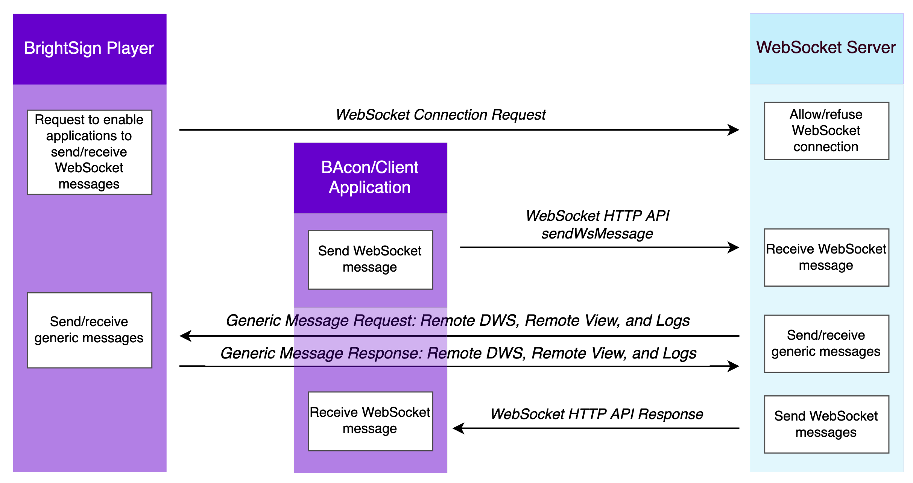

# Local and Remote Diagnostic Web Server APIs

These APIs allow you to connect to individual BrightSign players. They are especially useful if there are many devices on the network so you can more quickly find and access players.

*   [Local DWS APIs](./local-and-remote-diagnostic-web-server-apis/local-dws-apis.md) let you access your players on a local network. These APIs give you information about the player, let you reboot the player, see the health of SD card, and access all of the functionality of the calls that underlie the DWS in the BrightAuthor:connected UI. The local DWS APIs include Presentation Autorun Server APIs, which are hosted by the presentation autorun, and can be accessed with authentication from the local DWS. Only BrightScript objects in the presentation autorun know how to respond to these requests. Local DWS APIs are local player APIs and are authenticated through a username and password, not an OAuth bearer token.
    

*   The [Remote DWS APIs](./local-and-remote-diagnostic-web-server-apis/remote-dws-apis.md) are contained in the [WebSockets](https://brightsign.atlassian.net/wiki/spaces/DOC/pages/388434938/WebSockets) APIs, which use the WebSocket connection to leverage legacy endpoints that would otherwise only be addressable via the local network. Once a connection is established, the BrightSign WebSockets server can send WebSockets messages to BrightSign players. Depending on the operation, the BrightSign player may return information to the BrightSign Websockets server, which will be relayed in the server REST response to the client application. 
    
    The Remote DWS APIs allow you to access your player through BSN.cloud (using the bearer token for bsn.cloud) as well as get information about the player, reboot the player, see the health of SD card, and access all of the functionality of the calls that underlie the DWS in the BrightAuthor:connected UI.
    

