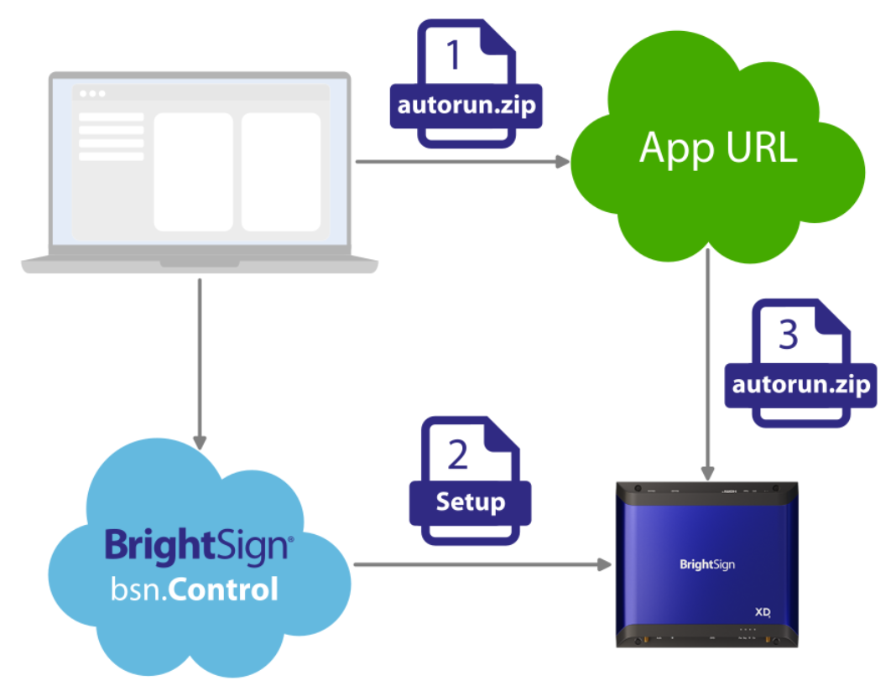

# App URL

In the hands-on example, a player was manually provisioned by physically copying a Player App to the player’s storage device. Since the BrightSign Default Setup was acceptable, provisioning of the player did not require a new Setup to be explicitly applied.

While manual provisioning is a very straightforward process, it poses challenges when multiple players are involved, players are in remote or hard-to-access locations, and/or the content needs to be updated frequently. Remote provisioning can therefore be highly beneficial in many scenarios.

The recommended method for partner provisioning of players, either manually or remotely, is through the use of Setups which can freely be created via bsn.Control at control.bsn.cloud.

## App URL

The [Publishing Mode](https://brightsign.atlassian.net/wiki/spaces/DOC/pages/1968078934/Player+Setup+Provisioning#Publishing-Mode) is one of the important settings included in a Setup, and the App URL Publishing Mode is an effective way to remotely get content onto players. More details of this setup can be found [here](https://brightsign.atlassian.net/wiki/spaces/DOC/pages/2237005844/Publishing+Mode#App-URL), but a summary is as follows:

1.  The desired *autorun.brs* or *autorun.zip* file is uploaded to a player-accessible URL. The *autorun.zip* file includes the essentials (*autozip.brs* and *autorun.brs*) and, if desired, the presentation file and associated content files. The URL path to the *autorun.brs* or *autorun.zip* file is designated as the App URL (an example App URL is available at [https://www.brightsign.biz/examples/autorun.zip](https://www.brightsign.biz/examples/autorun.zip) which you may use).
    
2.  The player is configured with the App URL. There are several ways to do this:
    
    1.  An App URL can be applied directly to a player or group of players from the Provision screen, accessible from the Admin menu of the bsn.Control interface. You will be shown one way to do this in the next section.
        
    2.  Create an App URL Setup using the bsn.Control interface (more info about creating Setups can be found [here](https://brightsign.atlassian.net/wiki/spaces/DOC/pages/395313598/Setup)).
        
        1.  The Setup contains info about the App URL.
            
        2.  The Setup can be remotely applied to a player or group of internet-connected players.
            
        3.  Players download the *autorun.brs* or *autorun.zip* file from the App URL specified in the Setup.
            
3.  Player(s) configured for an App URL will, upon booting, download the [*autorun.br*](http://autorun.br)s or *autorun.zip* file from the specified App URL. If the file is an *autorun.zip* file containing an *autozip.brs* file, the player will unzip that file. The player will then reboot, and then run the *autorun.brs* file.
    

Next, we will walk through another hands-on example in which we provision a player directly to use an App URL.

[Next - Example (App URL) >](../integrating-with-brightsign/example-app-url.md)