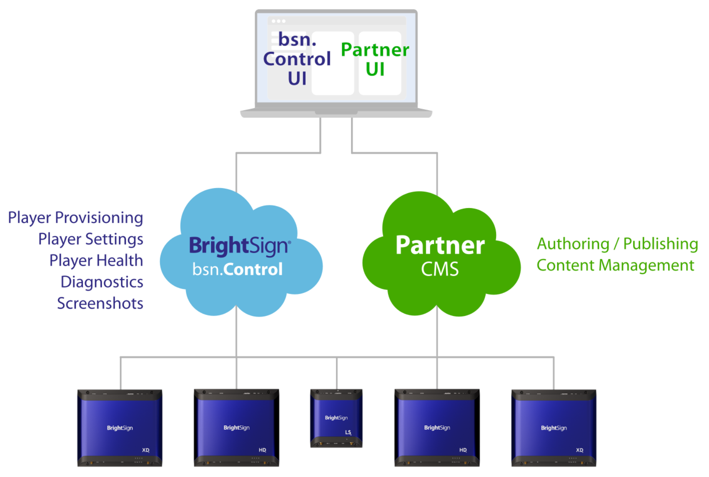
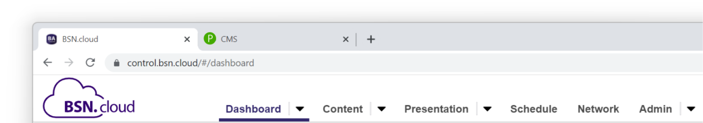
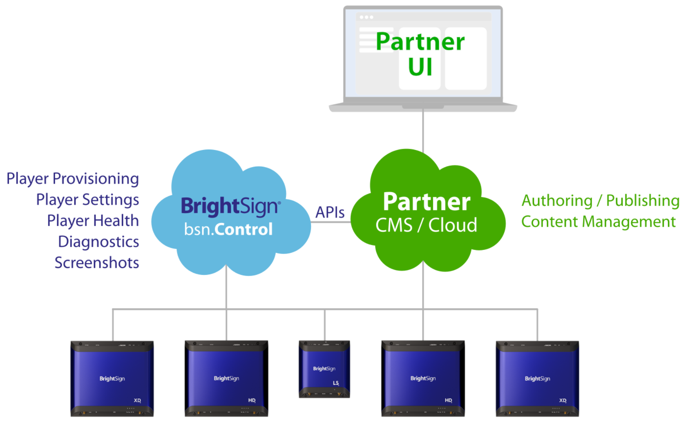

# bsn.Control Integration

Partners are highly encouraged to take advantage of the free, yet powerful, tools offered by bsn.Control. The two most common ways for partners to utilize bsn.Control are:

*   The “Swivel” approach
    
*   API integration between the partner CMS and the bsn.Control
    

## “Swivel” Approach

One of the easiest ways for a partner to get up and running is with the “Swivel Chair” approach. With this method, end users utilize bsn.Control *alongside* the partner CMS.

With this approach, end users have full access to the capabilities of the bsn.Control via the unbranded web interface at control.bsn.cloud. By having one browser tab for the CMS and another browser tab for bsn.Control, users can quickly “swivel” back and forth between the CMS and bsn.Control.

## API Integration

Using BrightSign’s APIs, partners are able to design their own custom user interfaces to access the underlying functions of the bsn.Control. End users will then interact with a single UI for authoring, publishing, content management, and player management.

Next, let’s take a look at one of the ways the bsn.Control can used to remotely provision players.

[Next - App URL >](../integrating-with-brightsign/app-url.md)