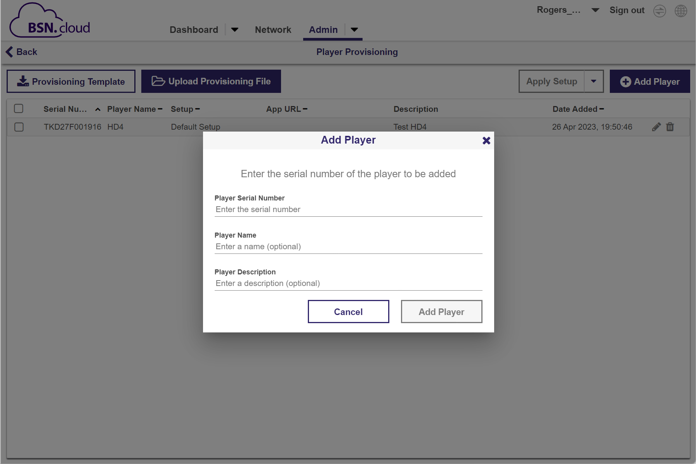
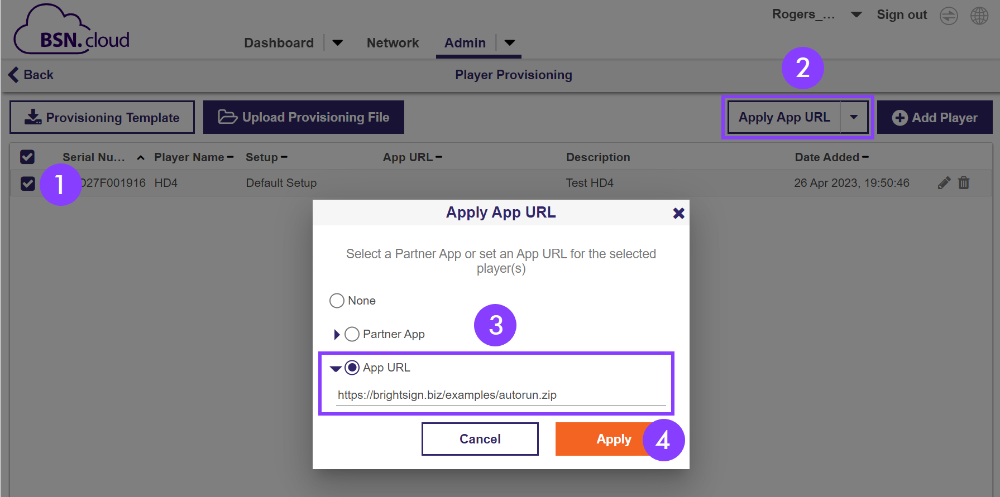

# Example (App URL)

In this example, we will be provisioning a player to use the App URL Publishing Mode.

## Player Preparation

To better reflect the most likely experience of a real-world user, we will proceed as if the player is brand new.

If you had previously used the player to follow along with the Manual Setup Example, you can simply erase/reformat the storage device and reinsert into the player. Since the player was not explicitly provisioned with BSN.cloud (the BrightSign Default Setup was used), the player does not need to be reprovisioned.

If you had previously activated the player for use with BSN.cloud, however, refer to the directions [here](https://brightsign.atlassian.net/wiki/spaces/DOC/pages/395313614/Provision#Reprovisioning) on how to delete the player’s provisioning record and then return here.

> [!WARNING]
> In this example, we will be provisioning the player *prior* to booting up the player for the first time. If a new player does not already have a provisioning record with BSN.cloud, powering up the player will take the user to the [Activation](https://brightsign-sandbox-694.atlassian.net/wiki/spaces/DOC/pages/6560502) screen. Activation provisions the player with the current Default Setup. Unless another default Setup has been created, the player will be provisioned with the BrightSign Default Setup which uses the bsn.Content as the Publishing Mode. Reprovisioning the player would then be required to apply a different Setup. Provisioning the player prior to activating the player thus saves the step of having to reprovision the player.

## Provision Player

1.  Do *not* power up the player.
    
2.  Write down the player’s Serial Number. The Serial Number can be found on the label on the bottom of the player itself or on a label on the box that the player was packaged in.
    
3.  Go to **Admin** > **Provision** > **Add Player**. Enter the Serial Number you wrote down. If desired, you can also enter an optional Player Name and Player Description.
    
4.  Select **Add Player**.
    

The player should now appear in the list of players. Note that it has been assigned the Default Setup. If you have not explicitly created a new Default Setup, this Default Setup will be the BrightSign Default Setup.

Next:

1.  Select the player you wish to provision. This should be the player with the serial number you just added above.
    
2.  Select **Apply App URL** from the drop-down menu.
    
3.  In the pop-up window, select **App URL** and enter the URL where the desired *autorun.zip* file resides. If you like, you can use the example URL here: [https://www.brightsign.biz/examples/autorun.zip](https://brightsign.biz/examples/autorun.zip)
    
4.  Select **Apply**.
    

The player is now provisioned for the App URL publishing mode. All of the other player settings, since they have not been explicitly changed, remain per the BrightSign Default Setup.

## Power Up Player

Power up the player. Once the player has booted, it will search for a provisioning record on BSN.cloud. If a record is found, the player will apply the settings according to its provisioning record. Since we created a provisioning record for this player in the previous steps, the player will apply those settings. In this case, the provisioning record instructs the player to go to the designated URL, download the *autorun.zip* file there, unzip that file, and then reboot to run the *autorun.brs* within the *autorun.zip* file. The *autorun.brs* file has been configured to display the HTML presentation contained in the *autorun.zip* file.

The same presentation that was previously displayed with the manual copy example should now be shown on the screen. Whereas with the previous example, the *autorun.zip* file was manually copied to the player’s storage device, the player now has been remotely provisioned to retrieve the *autorun.zip* file from a URL.

[Next - Developer Tools >](../integrating-with-brightsign/developer-tools.md)